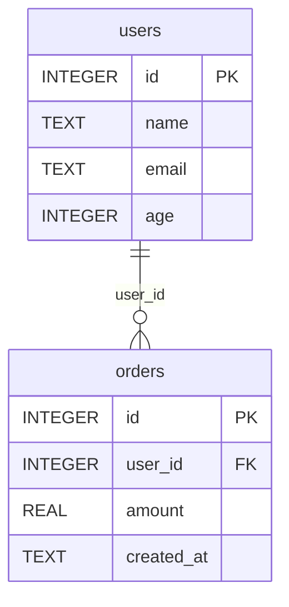

# database-scout

Read-only exploration tool for SQLite / PostgreSQL databases — inspect table schemas, preview data, generate ER diagrams, and run safe queries.

## Feature Overview

| Feature | Description |
|---------|-------------|
| List all tables | Show tables and views in the database, with row counts |
| Inspect table schema | Column names, types, constraints (PK/FK/NOT NULL), indexes, defaults |
| Data preview | View the first N rows of a table |
| ER diagram generation | Output Mermaid erDiagram syntax, ready to render |
| Safe read-only queries | Only SELECT/WITH/EXPLAIN allowed; write operations are blocked |

## Security Mechanisms

- **Connection-level read-only**: SQLite opens with `?mode=ro` URI; PostgreSQL uses `SET SESSION READ ONLY`
- **SQL whitelist**: Only statements starting with SELECT / WITH / EXPLAIN / PRAGMA / SHOW are allowed
- **Dangerous keyword blocking**: INSERT, UPDATE, DELETE, DROP, ALTER, CREATE, and 30+ other keywords are blocked
- **Multi-statement blocking**: Semicolon-separated multiple SQL statements are rejected (prevents injection)
- **Identifier escaping**: Table names are double-quote escaped to prevent SQL injection

## Quick Start

```bash
# List all tables in a SQLite database
python3 scripts/db_explorer.py --db-path data.db list-tables

# Inspect table schema
python3 scripts/db_explorer.py --db-path data.db describe users

# Preview data (default 20 rows)
python3 scripts/db_explorer.py --db-path data.db preview orders --limit 10

# Generate Mermaid ER diagram
python3 scripts/db_explorer.py --db-path data.db er-diagram

# Run a read-only query
python3 scripts/db_explorer.py --db-path data.db query "SELECT name, age FROM users WHERE age > 18 LIMIT 10"
```

### PostgreSQL

```bash
# Connect to PostgreSQL
python3 scripts/db_explorer.py --db-type postgres --dsn "host=localhost dbname=mydb user=reader" list-tables

# Inspect table schema
python3 scripts/db_explorer.py --db-type postgres --dsn "host=localhost dbname=mydb user=reader" describe orders
```

## Detailed Usage

### Parameters

| Parameter | Required | Default | Description |
|-----------|----------|---------|-------------|
| `--db-type` | No | sqlite | Database type: sqlite or postgres |
| `--db-path` | Yes (for SQLite) | — | Path to the SQLite database file |
| `--dsn` | Yes (for PostgreSQL) | — | PostgreSQL connection string |

### Subcommands

| Command | Description | Example |
|---------|-------------|---------|
| `list-tables` | List all tables/views | `list-tables` |
| `describe <table>` | Show detailed table schema | `describe users` |
| `preview <table> [--limit N / -n N]` | Preview the first N rows | `preview orders --limit 5` |
| `er-diagram` | Generate Mermaid ER diagram | `er-diagram` |
| `query "<sql>"` | Run a read-only SQL query | `query "SELECT count(*) FROM users"` |

## Output Examples

### list-tables

```json
[
  {"name": "users", "type": "table", "row_count": 1500},
  {"name": "orders", "type": "table", "row_count": 8200},
  {"name": "user_stats", "type": "view", "row_count": 1500}
]
```

### describe

```json
{
  "table": "orders",
  "row_count": 8200,
  "columns": [
    {"cid": 0, "name": "id", "type": "INTEGER", "notnull": true, "default": null, "primary_key": true},
    {"cid": 1, "name": "user_id", "type": "INTEGER", "notnull": true, "default": null, "primary_key": false},
    {"cid": 2, "name": "amount", "type": "REAL", "notnull": false, "default": "0.0", "primary_key": false}
  ],
  "foreign_keys": [
    {"from": "user_id", "to_table": "users", "to_column": "id"}
  ],
  "indexes": [
    {"name": "idx_orders_user_id", "unique": false, "columns": ["user_id"]}
  ]
}
```

### er-diagram (Mermaid)



## Dependencies

- Python 3.8+ (`sqlite3` is a built-in module)
- PostgreSQL support requires: `pip install psycopg2-binary`
